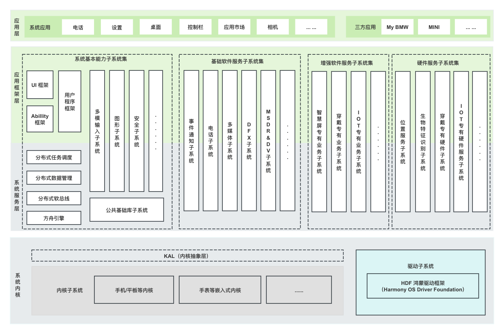
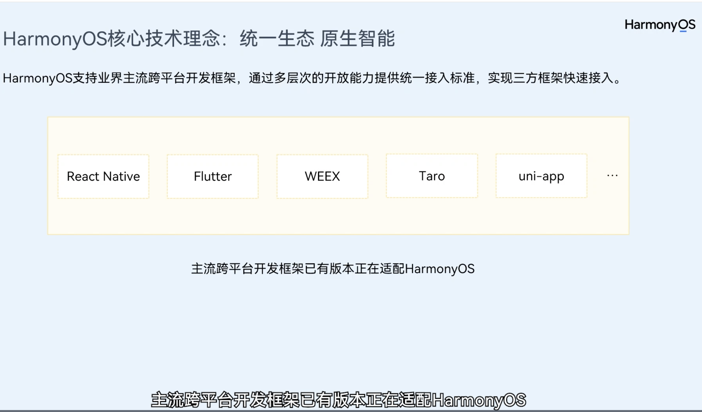
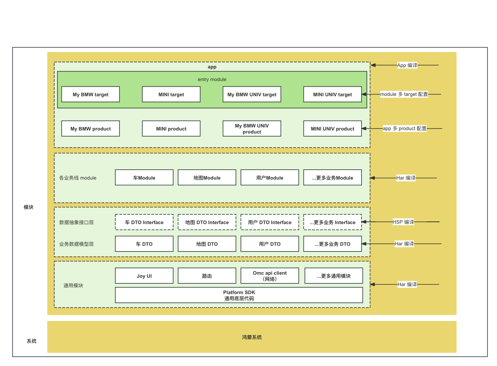

## 鸿蒙原生介绍
- 纯血鸿蒙原生的现状
    - 纯血鸿蒙从 2023 年 9 月开始启动，也就是华为 Mate 60 发布后，开始对接一些大型互联网公司，进入保密开发阶段。
    - 目前最新的 api 版本是 11，开发工具是 DevEco，使用 ArkTS 作为开发语言，和微软主导的 TS 语言在语法上是交集的关系，在编译器层面是华为自研的方舟编译器，编译完成的字节码是 abc 格式，在安装运行的时候通过 JIT 变成机器码。
    - 纯血鸿蒙不同于传统鸿蒙，不再兼容安卓的 apk，从系统内核，到应用开发语言/框架都是全新的。
    - 目前纯血鸿蒙提供了类似安卓/iOS 的系统能力，比如多种持久化存储（数据库存储，key-value存储，跨设备存储），多媒体能力，系统组件的生命周期维护等等。
    - 纯血鸿蒙原生的 ArkTS 设计，考虑到了 app 在手机，平板多端的响应式 UI 需求，在 ArkUI 的框架内置了对应的组件，并在未来提供对电脑端支持。
- 鸿蒙原生的未来
  - 鸿蒙原生开发，在技术兼容层面会模仿 iOS 的策略， 也就是业务开发需要维护多个 API 版本的兼容问题，去单独适配。
  - ArkUI 作为华为自身维护的 UI框架，未来是华为官方维护的核心，在开发语言，编译器，集成开发环境上会提供越来越完善的适配。
- 华为纯血鸿蒙的技术资料：
  - https://developer.huawei.com/consumer/cn/doc/harmonyos-guides/application-dev-guide-0000001630265101
  - 账号：18102010271 密码：1qaz2wsx (异地设备登录可能需要短信验证码，直接找我。另外不要大肆传播，可能会被封号)。
- 鸿蒙系统架构：
- 

## Flutter on 鸿蒙介绍
- 鸿蒙 Flutter 的现状
  - 鸿蒙 Flutter 基于 google 官方的 Flutter 的 3.7.12 版本进行适配，是华为和社区共建的一个版本。
  - 目前官方基于和商业伙伴的合作关系比如阿里的闲鱼等，在打磨这个版本的稳定性。
  - 官方也在推进鸿蒙的插件生态，详细的适配列表见：https://docs.qq.com/sheet/DVVJDWWt1V09zUFN2 。
  - [官方目前号称支持的跨端情况](https://developer.huawei.com/consumer/cn/training/course/video/C101705589427300086) (视频第四分钟)：
    - 
- 鸿蒙 Flutter 的未来
  - Flutter 作为跨平台自绘制方案，在性能方面和原生伯仲之间。考虑到纯血鸿蒙支持 Vulkan 图形 API，未来的性能还会继续升高。
  - Flutter 作为自绘制方案，在对接新操作系统的时候，需要对接的代码远小于 React Native 这样的桥接方案，在迁移的便利性上，接近于 Unity 游戏引擎。
  - 华为打算一年挑选一个官方的 flutter 版本，跟进适配，从而我们至少每年有一个新版本可以用。
  - 如果纯血鸿蒙的生态足够强大后，不排除 flutter 官方会添加对鸿蒙的支持。

## 我们的选型方案思路：
- 我们的选型方案：
    - 短期有两种方案，原生或者 Flutter
      - 原生的开发：
        - 优势是华为官方负责开发，具有较完整的开发 IDE 支持，较快的 bug 响应速度，阻塞风险较小。
        - 劣势是现有My BMW/MINI 代码复用度几乎为零。
      - Flutter 的开发
        - 优势是可以复用目前My BMW九成代码，尤其是 UI 相关的业务逻辑不受影响，这也是代码最多的地方。
        - 劣势是目前由华为维护，相对官方的维护力度要小，需要华为的商业合作来避免阻塞问题。
    - 长期几乎完全确定使用 Flutter，也就是说，无论短期怎么选，长期要回归 Flutter，原生顶多应付下短期版本。
    - 德国总部的人来过后，我们倾向于使用 Flutter 做调研，持续到 7 月底，如果没有阻塞问题，就直接使用 Flutter 方案。

## 使用 Flutter on Harmony的架构设计
- 新增绿色部分，也就是 Flutter 方案所需要做的工作。
- 工作主要内容是插件，通过插件使用系统的安全/AI 等各项能力。
- 白色的是现有的代码，可以直接复用。
- 

## 鸿蒙原生架构设计
- 通过业务分层架构，实现业务逻辑纵向依赖，方便后续维护和拓展。
- 通过 HAR，HSP，App 编译，控制 app 的体积和加载性能。
- 通过 Platform SDK 和鸿蒙系统对接，利用系统的安全/AI 等各项能力。
- 

